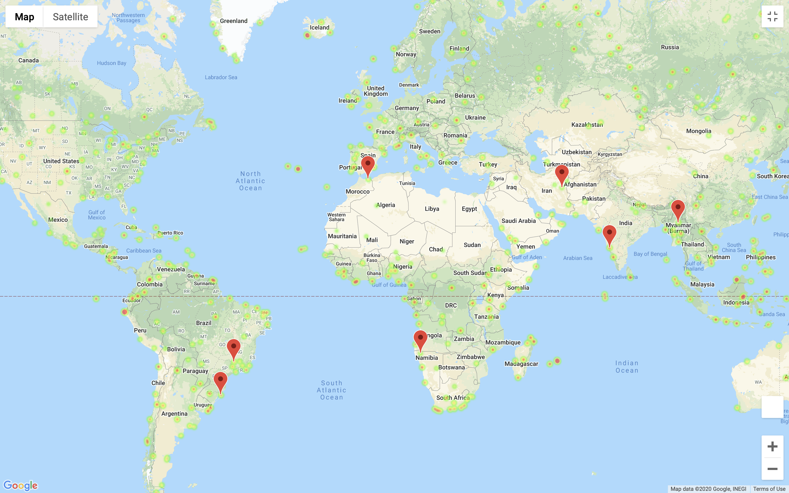
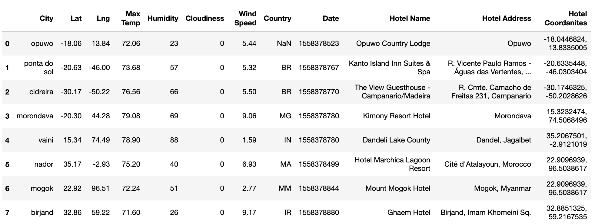

# Best Vacation Locations 

## Scope

This repository uses weather API's to find loactions with the ideal weather for a vacation. Using python locations were filtered to be sure that they had:

    1. A max temperature lower than 80 degrees but higher than 70.

    2. Wind speed less than 10 mph.

    3. Zero cloudiness.

Then aftering finding and mapping these locations hotels were found for each location to give users options of where to stay. 

